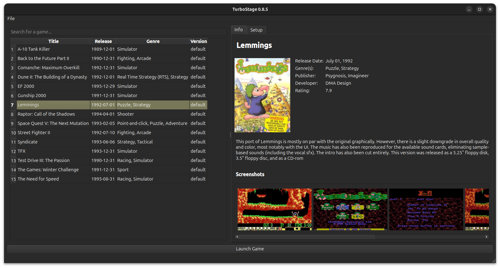

# Turbo Stage

[](https://github.com/jberclaz/turbostage/actions/workflows/unit_tests.yml)


**Turbo Stage** is a user-friendly frontend for [DOSBox
Staging](https://github.com/dosbox-staging/dosbox-staging), designed
to simplify launching and managing DOS games. With Turbo Stage, you
can easily organize your game library, configure emulator settings,
and enjoy classic games with minimal setup.  The project was inspired
by [fs-uae-launcher](https://github.com/FrodeSolheim/fs-uae-launcher).



## Features
- Intuitive interface to manage and launch DOS games.
- Automatic detection and configuration of supported games.
- Built-in support for downloading DOSBox Staging and MT-32 ROMs.
- Customizable emulator settings for each game.
- Support for game-specific setup programs to configure sound, input, and more.

## Prerequisites
- A modern operating system (Windows, macOS or Linux).
- [DOSBox Staging](https://github.com/dosbox-staging/dosbox-staging) (can be downloaded via Turbo Stage).
- Optional: MT-32 ROM files for enhanced music in supported games (can be downloaded via Turbo Stage).
- A collection of DOS games in `.zip` or `.iso` format.

## macOS Notes

The app is not signed with an Apple Developer certificate, so Gatekeeper may block it on first launch. To bypass, open Terminal and run:

```bash
xattr -d com.apple.quarantine /path/to/TurboStage.app
```

Or go to **System Settings → Privacy & Security** — look for a message about TurboStage being blocked and click **Open Anyway**.

After the first launch, the app will open normally in the future.

## Getting started

1. Launch **Turbo Stage** and navigate to **File > Settings**.
2. Configure the following:
   - **DOSBox Staging Path**: Select the path to your DOSBox Staging installation or click **Download** to install it automatically.
   - **Games Path**: Choose the folder where your DOS games are stored.
   - **MT-32 ROMs** (optional): Select the location of MT-32 ROM files for enhanced music or click **Download** to fetch them.
3. Go to **File > Update Game Database** to download default settings for supported games. (Note: The database is limited but will expand in future updates.)

## Adding Games
1. Place your DOS games (in `.zip` or `.iso` format) in the **Games Path** folder specified in Settings.
2. Go to **File > Scan Local Games** to automatically detect and configure recognized games.
3. For unrecognized games, select **File > Add New Game** and follow the prompts to manually configure them.

### ISO Games
Some games were distributed on CD-ROM and need to be installed to a hard drive before playing. When adding an ISO game:

1. Select **File > Add New Game** and pick your `.iso` file.
2. In the wizard, check **Requires hard drive installation** if the game needs to be installed.
3. Choose the installation program from the CD (usually `setup.exe` or `install.exe`).
4. The game will appear grayed out with an **Install Game** button.

## Running a Game
- **Double-click** a game in the left panel to launch it.
- Alternatively, select a game and click the **Launch Game** button at the bottom of the window.

### Installing ISO Games
1. Select a game that needs installation (grayed out) and click **Install Game**.
2. DOSBox will start with the CD mounted as `D:` and the install directory as `C:`.
3. Run the installation program inside DOSBox to install the game to `C:`.
4. Close DOSBox when done — a dialog will open showing the installed files.
5. Select the game executable (e.g., `MEGARACE/GAME.EXE`) from the install directory.
6. The game is now ready to play. Right-click it for **Reinstall** or **Uninstall** options.

## Configuring a Game
1. **Right-click** a game in the left panel and select **Run Game Setup**.
2. Choose the game's setup executable and click **Setup** to enter the game's setup menu. The settings you choose will be saved for future sessions.
   - Common setup executable names include `setup.exe`, `soundset.exe`, or `config.exe`.
   - Note: Not all games have a setup program, but most allow configuration of sound cards and input methods.
3. Save your settings to apply them for future game sessions.


## Adjusting Emulator Options
1. Select a game and navigate to the **Setup** tab in the right panel.
2. Customize options such as:
   - **Game Executable**: Choose the main executable (for installed ISO games, this lists files from the install directory).
   - **Emulator Speed**: Choose **Auto** for optimal performance or adjust manually.
   - **Additional DOSBox Options**: Pass custom commands to DOSBox Staging for advanced configuration.
