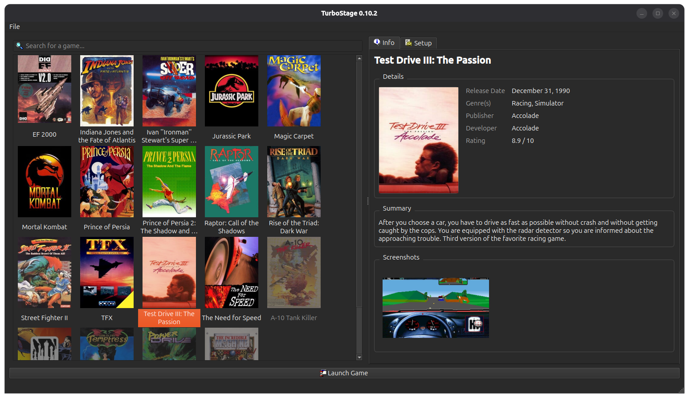

# TurboStage

[](https://github.com/jberclaz/turbostage/actions/workflows/unit_tests.yml)


**Relive the golden age of PC gaming — without the hassle.**

**TurboStage** is a friendly frontend for [DOSBox Staging](https://github.com/dosbox-staging/dosbox-staging) that turns your pile of DOS games into a beautiful, ready-to-play library. Drop in your `.zip` or `.iso` files, and TurboStage handles detection, setup, sound configuration, and launching. No command line, no config-file wrestling.

Built for Windows, macOS, and Linux. Inspired by [fs-uae-launcher](https://github.com/FrodeSolheim/fs-uae-launcher).



👉 **Download the latest release:** [GitHub Releases](https://github.com/jberclaz/turbostage/releases)

## Why you'll love it

- 🎮 **Your games, beautifully organized** — a cover-art grid library with search, just like a modern game launcher. Prefer lists? One click switches back.
- 🖼️ **Rich game pages** — automatic cover art, screenshots, story summary, release date, genre, publisher, developer, and community rating.
- ⚡ **Play in seconds** — double-click to launch. Smart scanning auto-detects your games, even if files are organized differently inside the archive.
- 🎵 **Authentic retro music** — one-click setup for Roland MT-32 and Roland Sound Canvas (SC-55) with per-game MIDI selection. Hear Doom, Monkey Island, and Sierra classics exactly as they were meant to sound.
- 💿 **CD-ROM classics work too** — full support for ISO games, including guided hard-drive installation for games that need it.
- 🔧 **No tinkering required (but you can)** — sensible defaults out of the box, with simple per-game controls for CPU speed (from 8088 to Pentium II), setup utilities, and advanced DOSBox options when you want them.
- 📥 **One-click everything** — downloads DOSBox Staging, MT-32 ROMs, SoundCanvas ROMs, supported games, and community configs directly from the app.
- ✨ **Feels at home** — retro-styled icons, light/dark theme support, fullscreen play, and optional floppy/hard-disk noise for maximum nostalgia.

## New & noteworthy

- **Cover-art grid view** — your library now looks like a real game collection. Downloadable games fade out so you instantly see what's ready to play.
- **Roland Sound Canvas support** — alongside MT-32, with one-click ROM download and a simple per-game `None / MT-32 / Sound Canvas` switch.
- **Revamped Setup tab** — clear Game / Performance / Advanced sections, game vs. setup executable picker, CPU presets, and Reset/Save controls.
- **Smarter game adding** — the Add Game wizard now guesses the title from the filename and searches the game database for you.
- **Better CD-ROM handling** — more reliable detection of ISO games and a smoother install flow.
- **Latest DOSBox Staging (0.83.0)** — better compatibility, better sound, better performance.
- **Community-powered** — share your working configs with one click via **File > Upload local config**, and benefit from others via **File > Update game database**.

## Getting started

You can be playing in about 2 minutes:

1. **Download and launch TurboStage** from [Releases](https://github.com/jberclaz/turbostage/releases).
2. Go to **File > Settings** and click **Download** for:
   - **Emulator Path** (DOSBox Staging — required)
   - **MT-32 / SoundCanvas ROMs** (optional, for the best music)
   - Set your **Games Path** — the folder where your games live.
3. Go to **File > Update Game Database**, then **File > Scan Local Games**.

That's it. Double-click any game to play.

> Tip: want a cleaner library? Uncheck **Show downloadable games in library** or **Display games as a grid of cover images** in Settings.

## Adding your games

1. Drop your DOS games (`.zip` or `.iso`) into your **Games Path** folder.
2. **File > Scan Local Games** — TurboStage detects and configures recognized games automatically.
3. Anything unrecognized? **File > Add New Game** walks you through it, with automatic title search and cover art.

### CD-ROM (ISO) games

Many CD games need to be installed to a hard drive first. TurboStage guides you:

1. **File > Add New Game**, pick your `.iso`, and check **Requires hard drive installation**.
2. Pick the installer (usually `setup.exe` or `install.exe`).
3. Select the grayed-out game and click **Install Game** — install to `C:` inside DOSBox, close it, then pick the game executable.
4. Play! Right-click anytime for **Reinstall** or **Uninstall**.

## Sound like it's 1992 again 🎵

TurboStage makes classic MIDI music painless:

1. In **Settings**, click **Download** next to **MT-32 ROMs** and/or **SoundCanvas ROMs**.
2. Select a game, open the **Setup** tab, and set **MIDI Device** to **MT-32** or **Sound Canvas**.
3. If a game sounds wrong, right-click it and choose **Run Game Setup** to select the matching music card inside the game's own setup program.

No ROMs? The setting safely falls back to default sound — nothing breaks.

Plus: enable **disk noise emulation** in Settings for authentic floppy/hard-drive clicks, and **fullscreen** for full immersion.

## Fine-tuning a game

- Select a game and open the **Setup** tab:
  - **Game executable / Config executable** — pick what to run and what configures sound/input.
  - **CPU** — leave on **Auto**, or dial in anything from an 8088 (4.77 MHz) to a Pentium II 300 for speed-sensitive classics.
  - **MIDI Device** — None, MT-32, or Sound Canvas, per game.
  - **Advanced** — raw DOSBox config for power users.
- Right-click any game for **Run Game Setup**, **Download**, **Reinstall/Uninstall**, and more.
- Use the search box above the library to instantly find a title.

## Free games, one click

1. **File > Update Game Database** to get the latest supported list.
2. Grayed-out entries are ready to download — right-click and choose **Download**, or select and click **Download Game**.
3. They land in your Games Path, ready to play.

If a downloaded game has no sound or won't start, right-click → **Run Game Setup** once to configure it.

## Prerequisites

- Windows, macOS, or Linux.
- A copy of your DOS games as `.zip` or `.iso` (or grab the free downloadable ones above).
- That's really it — DOSBox Staging and ROMs can be auto-downloaded from Settings.

## macOS Notes

The app isn't signed with an Apple Developer certificate, so Gatekeeper may block the first launch. In Terminal, run:

```bash
xattr -d com.apple.quarantine /path/to/TurboStage.app
```

Or go to **System Settings → Privacy & Security** and click **Open Anyway**.

After the first launch, it opens normally.

## Help the collection grow 🌱

Found perfect settings for a game? **File > Upload local config** shares them with the community. **File > Update game database** safely merges new entries without touching your local games.

Enjoy — and happy retro gaming!
