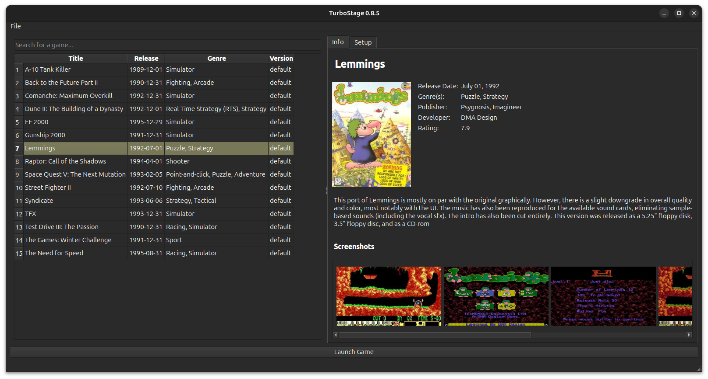

# Turbo Stage

**Turbo Stage** is a user-friendly frontend for [DOSBox
Staging](https://github.com/dosbox-staging/dosbox-staging), designed
to simplify launching and managing DOS games. With Turbo Stage, you
can easily organize your game library, configure emulator settings,
and enjoy classic games with minimal setup.  The project was inspired
by [fs-uae-launcher](https://github.com/FrodeSolheim/fs-uae-launcher).

## Features
- Intuitive interface to manage and launch DOS games.
- Automatic detection and configuration of supported games.
- Built-in support for downloading DOSBox Staging and MT-32 ROMs.
- Customizable emulator settings for each game.
- Support for game-specific setup programs to configure sound, input, and more.

## Prerequisites
- A modern operating system (Windows or Linux).
- [DOSBox Staging](https://github.com/dosbox-staging/dosbox-staging) (can be downloaded via Turbo Stage).
- Optional: MT-32 ROM files for enhanced music in supported games (can be downloaded via Turbo Stage).
- A collection of DOS games in `.zip` format.

## Getting started

1. Launch **Turbo Stage** and navigate to **File > Settings**.
2. Configure the following:
   - **DOSBox Staging Path**: Select the path to your DOSBox Staging installation or click **Download** to install it automatically.
   - **Games Path**: Choose the folder where your DOS games are stored.
   - **MT-32 ROMs** (optional): Select the location of MT-32 ROM files for enhanced music or click **Download** to fetch them.
3. Go to **File > Update Game Database** to download default settings for supported games. (Note: The database is limited but will expand in future updates.)

## Adding Games
1. Place your DOS games (in `.zip` format) in the **Games Path** folder specified in Settings.
2. Go to **File > Scan Local Games** to automatically detect and configure recognized games.
3. For unrecognized games, select **File > Add New Game** and follow the prompts to manually configure them.

## Running a Game
- **Double-click** a game in the left panel to launch it.
- Alternatively, select a game and click the **Launch Game** button at the bottom of the window.

## Configuring a Game
1. **Right-click** a game in the left panel and select **Run Game Setup**.
2. Choose the game's setup executable and click **Setup** to enter the game's setup menu. The settings you choose will be saved for future sessions.
   - Common setup executable names include `setup.exe`, `soundset.exe`, or `config.exe`.
   - Note: Not all games have a setup program, but most allow configuration of sound cards and input methods.
3. Save your settings to apply them for future game sessions.

## Adjusting Emulator Options
1. Select a game and navigate to the **Setup** tab in the right panel.
2. Customize options such as:
   - **Game Executable**: Specify the main executable for the game.
   - **Emulator Speed**: Choose **Auto** for optimal performance or adjust manually.
   - **Additional DOSBox Options**: Pass custom commands to DOSBox Staging for advanced configuration.
